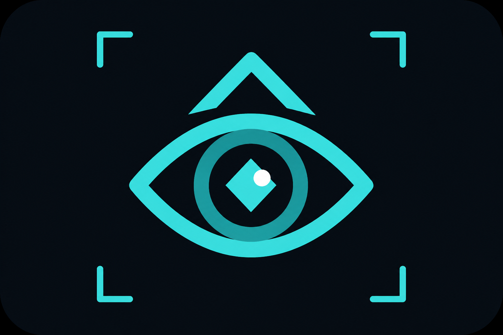

# Driftwatch

  

A maintained agent-engineering kit for people who ship with Cursor, Claude Code, or similar coding agents.

Free `.cursorrules` dumps rot. They say "write clean code." They do not fail a PR when an agent skips a test, guts a snapshot, or "fixes a typo" in README while rewriting billing.

**Made By Zer01**  
Artificially Intelligent, Digitally Enhanced.

No fake star counts. No testimonials.

This public repo is the **teaser**: three example rules. The paid kit adds the rest of the rules, `AGENTS.md` / `CLAUDE.md`, a GitHub Action that actually fails the PR, and an eval suite.

## Pricing

| Product | Price | What it is |
| --- | --- | --- |
| **Kit** | **$39** one-time (v0) | Full rules + Action + evals. 30-day refund. Not lifetime updates. |
| **Watch** | **$12/mo** or **$99/year** | Patches as models invent new cheats |

Checkout (Polar):

- Kit: https://buy.polar.sh/polar_cl_fchKa2xndgHxURruxfYlvnJgM7KTjAR8O1izQ1SdhFe
- Watch: https://buy.polar.sh/polar_cl_Kpzrep1r0L8eLeGtcP0ExA7cB2Kchii2Bf6Hp3jLZiD

Org: [github.com/driftwatch-kit](https://github.com/driftwatch-kit)

## Teaser rules

Copy `.cursor/rules/` if you want a taste. They are shorter and **not** CI-enforced on purpose.

## What the kit actually does

CI fails the job with codes like `out_of_scope`, `skipped_test`, `emptied_test`, `deleted_test`, `weakened_assertion`, `weakened_snapshot`, `unexplained_dependency`. Nothing phones home.

## License

Teaser files in this repo may be copied with the notice on each file left intact. The full pack is source-available for buyers, not MIT.
